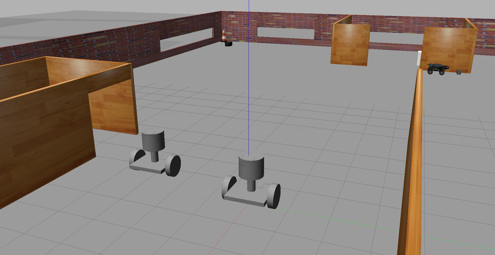
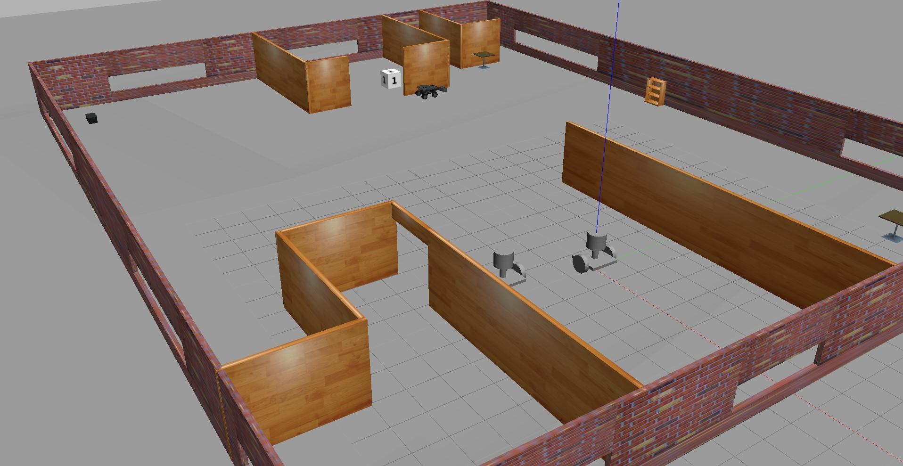
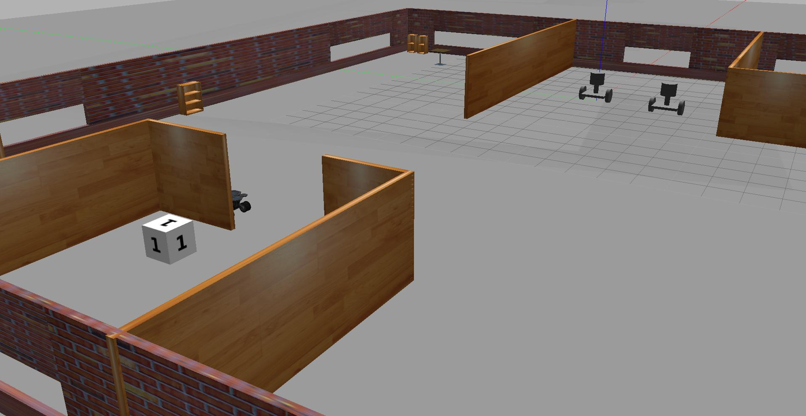

# Project #1 - Build My World

### Summary of Tasks
Let’s summarize what you should do in this project to create a simulation world for all your projects in this Robotics Software Engineer Nanodegree Program.
1. Build a single floor wall structure using the Building Editor tool in Gazebo. Apply at least one feature, one color, and optionally one texture to your structure. Make sure there's enough space between the walls for a robot to navigate.
2. Model any object of your choice using the Model Editor tool in Gazebo. Your model links should be connected with joints.
3. Import your structure and two instances of your model inside an empty Gazebo World.
4. Import at least one model from the Gazebo online library and implement it in your existing Gazebo world.
5. Write a C++ World Plugin to interact with your world. Your code should display “Welcome to ’s World!” message as soon as you launch the Gazebo world file.
   
These tasks are just the basic requirements for you to pass the project! Feel free to have fun designing and importing multiple models.

### Directory Structure


### Build Instructions

1. Clone this repo
2. Make welcome_message.cpp executable under script directory
```bash
chmod +x script/welcome_message.cpp
```
3. Create a build directory and compile the code
```bash
mkdir build
cd build
cmake ../
make
export GAZEBO_PLUGIN_PATH=${GAZEBO_PLUGIN_PATH}:<your workspace>/build
```
4. Launch the world file in Gazebo to load both the world and the plugin
```bash
cd script
gazebo UdacityOffice.world
```

### Output Images
<p align="center">
  
</p>

<p align="center">
  
</p>

<p align="center">
  
</p>

<p align="center">
  
</p>
