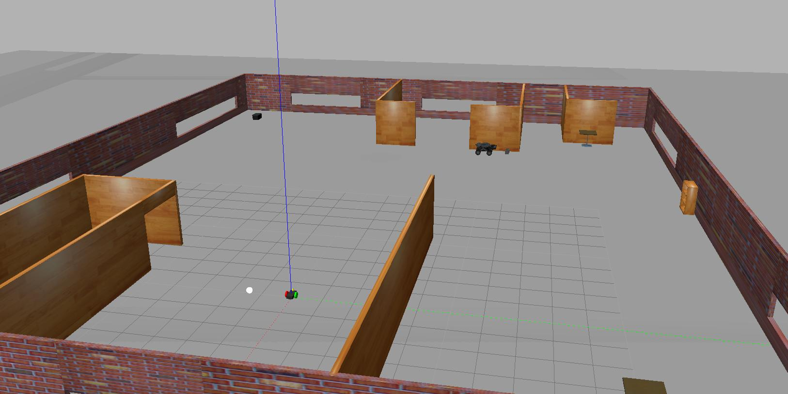
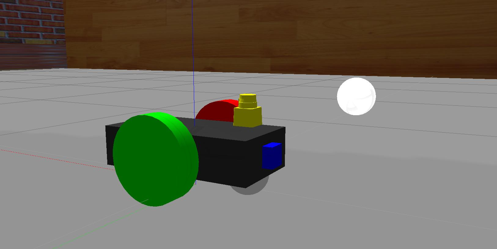
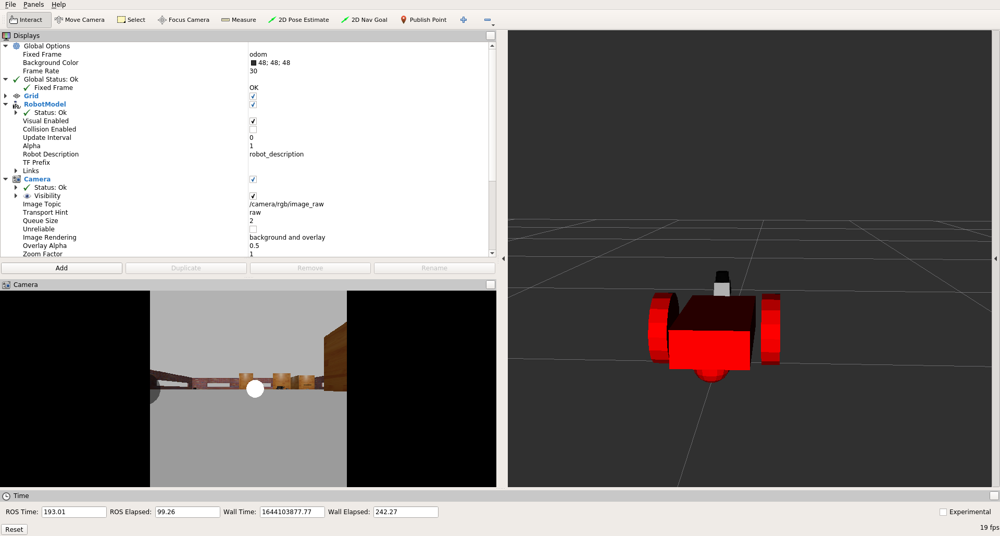

# Project #2 - Go Chase It!
<p align="center">
  
</p>

<p align="center">
  
</p>

<p align="center">
  
</p>

<p align="center">
  
</p>

### Summary of Tasks
In this project, you should create two ROS packages inside your `catkin_ws/src:` the `drive_bot` and the `ball_chaser`. Here are the steps to design the robot, house it inside your world, and program it to chase white-colored balls:
1. `drive_bot`:
	- Create a `my_robot` ROS package to hold your robot, the white ball, and the world.
	- Design a differential drive robot with the Unified Robot Description Format. Add two sensors to your robot: a lidar and a camera. Add Gazebo plugins for your robot’s differential drive, lidar, and camera. The robot you design should be significantly different from the one presented in the project lesson. Minimum required changes are adjusting the color, wheel radius, and chassis dimensions. You can also completely redesign the robot model!
	- Create a new world, which is different from the world you built in the <b>Build My World</b> project and house your robot inside that world.
	- Add a white-colored ball to your Gazebo world and save a new copy of this world.
	- The `world.launch` file should launch your world with the white-colored ball and your robot.

2. `ball_chaser`:
	- Create a `ball_chaser` ROS package to hold your C++ nodes.
	- Write a `drive_bot` C++ node that will provide a `ball_chaser/command_robot` service to drive the robot by controlling its linear x and angular z velocities. The service should publish to the wheel joints and return back the requested velocities.
	- Write a `process_image` C++ node that reads your robot’s camera image, analyzes it to determine the presence and position of a white ball. If a white ball exists in the image, your node should request a service via a client to drive the robot towards it.
	- The `ball_chaser.launch` should run both the `drive_bot` and the `process_image` nodes.

### Directory Structure
```bash

```

### Build Instructions
1. Open Terminal/CLI by using `Ctrl + Alt + T` shortcut.
2. Create and initialize a `catkin_ws`
```bash
mkdir -p /<your_dir>/catkin_ws/src
cd /<your_dir>/catkin_ws/src
catkin_init_workspace
```
3. Clone this repo inside `/<your_dir>/catkin_ws/src`
5. Ensure src directory has `my_robot` and `ball_chaser` directory inside it
6. Switch to `catkin_ws`
```bash
cd /<your_dir>/catkin_ws
```
7. Build the code and ensure there are no build errors reported
```bash
catkin_make
```
8. Launch RViz and Gazebo. This may take a while upon initial loading.
```bash
source devel/setup.bash
roslaunch my_robot world.launch
```
9. Setup RViz (ROS Visualization) to visualize sensor readings. On the left side of RViz, under `Displays`:
	- Select `odom` for fixed frame
	- Click the `Add` button and
		- add `RobotModel` and your robot model should load up in RViz.
		- add `Camera` and select the <b>rgb/image_raw</b> topic that was defined in the camera Gazebo plugin
		- add `LaserScan` and select the <b>/scan</b> topic that was defined in the Hokuyo Gazebo plugin
10. Open another Terminal/CLI by using `Ctrl + Alt + T` shortcut.
Switch to `catkin_ws`
```bash
cd /<your_dir>/catkin_ws
```
11. Run `drive_bot` and `process_image`, which can be done by executing `ball_chaser.launch`
```bash
source devel/setup.bash
roslaunch ball_chaser ball_chaser.launch
```
12. In Gazebo, move the white ball around so its in the robot's cameras field of view. The robot will move right if the white ball is found on the right side, left for left and forward if its in the center region. The robot will not move if there is no white ball detected in the camera.