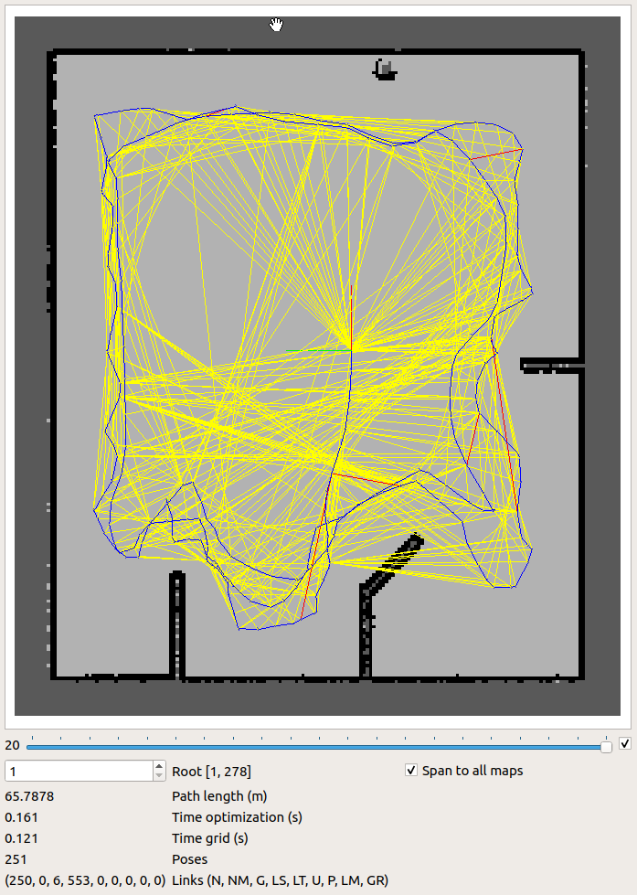
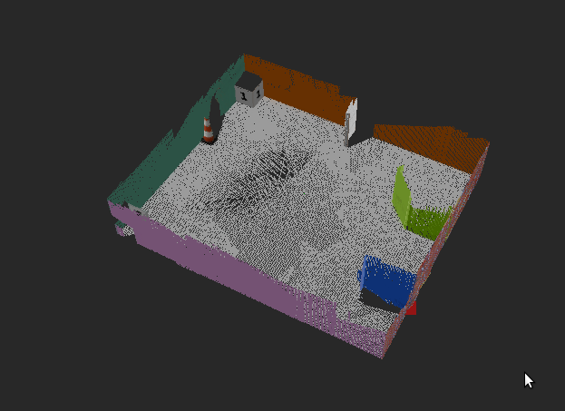

# Project #4 - Map My World!
<p align="center">
  
</p>
<p align="center">
  
</p>
<p align="center">
  
</p>

### Overview
In this project you will create a 2D occupancy grid and 3D octomap from a simulated environment using your own robot with the RTAB-Map package.</br>

RTAB-Map (Real-Time Appearance-Based Mapping) is a popular solution for SLAM to develop robots that can map environments in 3D. RTAB-Map has good speed and memory management, and it provides custom developed tools for information analysis. Most importantly, the quality of the documentation on ROS Wiki (http://wiki.ros.org/rtabmap_ros) is very high. Being able to leverage RTAB-Map with your own robots will lead to a solid foundation for mapping and localization well beyond this Nanodegree program.</br>

For this project we will be using the `rtabmap_ros` package, which is a ROS wrapper (API) for interacting with RTAB-Map. Keep this in mind when looking at the relative documentation.

### Project Instructions
The project flow will be as follows:
1. You will develop your own package to interface with the `rtabmap_ros` package.
2. You will build upon your localization project to make the necessary changes to interface the robot with RTAB-Map. An example of this is the addition of an RGB-D camera.
3. You will ensure that all files are in the appropriate places, all links are properly connected, naming is properly setup and topics are correctly mapped. Furthermore you will need to generate the appropriate launch files to launch the robot and map its surrounding environment.
4. When your robot is launched you will `teleop` around the room to generate a proper map of the environment.

### Directory Structure
```bash
.Project4
├── ball_chaser
│         ├── CMakeLists.txt
│         ├── launch
│         │         └── ball_chaser.launch
│         ├── package.xml
│         ├── src
│         │         ├── drive_bot.cpp
│         │         └── process_image.cpp
│         └── srv
│             └── DriveToTarget.srv
├── my_robot
│         ├── CMakeLists.txt
│         ├── config
│         │         ├── base_local_planner_params.yaml
│         │         ├── costmap_common_params.yaml
│         │         ├── global_costmap_params.yaml
│         │         ├── local_costmap_params.yaml
│         │         └── __MACOSX
│         ├── launch
│         │         ├── amcl.launch
│         │         ├── mapping.launch
│         │         ├── robot_description.launch
│         │         ├── teleop.launch
│         │         └── world.launch
│         ├── maps
│         │         ├── map.pgm
│         │         ├── map.yaml
│         │         └── rtabmap.db
│         ├── meshes
│         │         └── hokuyo.dae
│         ├── package.xml
│         ├── RVIZLaunchConfig.rviz
│         ├── urdf
│         │         ├── my_robot.gazebo
│         │         └── my_robot.xacro
│         └── worlds
│             ├── empty.world
│             ├── minimap.world
│             └── UdacityOffice.world
├── pgm_map_creator
│         ├── CMakeLists.txt
│         ├── launch
│         │         └── request_publisher.launch
│         ├── LICENSE
│         ├── maps
│         │         └── map.pgm
│         ├── msgs
│         │         ├── CMakeLists.txt
│         │         └── collision_map_request.proto
│         ├── package.xml
│         ├── README.md
│         ├── src
│         │         ├── collision_map_creator.cc
│         │         └── request_publisher.cc
│         └── world
│             └── udacity_mtv
├── README.md
└── teleop_twist_keyboard
    ├── CHANGELOG.rst
    ├── CMakeLists.txt
    ├── package.xml
    ├── README.md
    └── teleop_twist_keyboard.py
```

### Build Instructions
1. Open Terminal/CLI by using `Ctrl + Alt + T` shortcut.
2. Create and initialize a `catkin_ws`
```bash
mkdir -p /<your_dir>/catkin_ws/src
cd /<your_dir>/catkin_ws/src
catkin_init_workspace
```
3. Clone this repo inside `/<your_dir>/catkin_ws/src`. Pull all submodules by running
```bash
git submodule update --init --recursive
```
4. Ensure `ros-kinetic-rtabmap-ros` package is installed. If not, install by running the following:
```bash
sudo apt-get install ros-kinetic-rtabmap-ros
```
5. Switch to `catkin_ws`
```bash
cd /<your_dir>/catkin_ws
```
6. Build the code and ensure there are no build errors reported
```bash
catkin_make
```
7. Launch RViz and Gazebo. This may take a while upon initial loading.
```bash
source devel/setup.bash
roslaunch my_robot world.launch
```
8. Open another Terminal/CLI by using `Ctrl + Alt + T` shortcut. Switch to `catkin_ws`
```bash
cd /<your_dir>/catkin_ws
```
9. Run `teleop` node, which can be done by executing `teleop.launch`
```bash
source devel/setup.bash
roslaunch my_robot teleop.launch
```
10. Open another Terminal/CLI by using `Ctrl + Alt + T` shortcut. Switch to `catkin_ws`
```bash
cd /<your_dir>/catkin_ws
```
11. Run `mapping` node, which can be done by executing `mapping.launch`
```bash
source devel/setup.bash
roslaunch my_robot mapping.launch
```
12. Navigate your robot in the simulation to create map for the environment! When you are all set, terminate the node and you could find your map db file in the place specified in the mapping.launch file. It will be named rtabmap.db and located in the /my_robot/maps/ folder. Note: if rtabmap.db exists, it will override it when the nodes are launched.
13. To open the mapping database, execute the following in a terminal:
```bash
rtabmap-databaseViewer /<your_dir>/catkin_ws/src/my_robot/maps/rtabmap.db
```
14. Once opened:
- Say yes to using the database parameters
- View -> Constraint View
- View -> Graph View