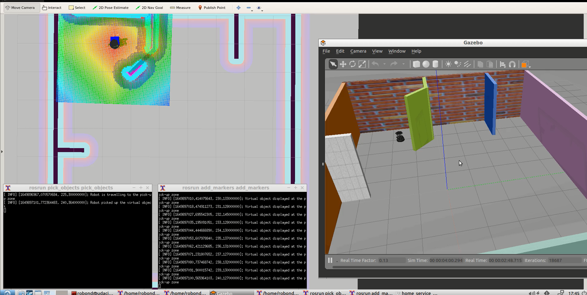
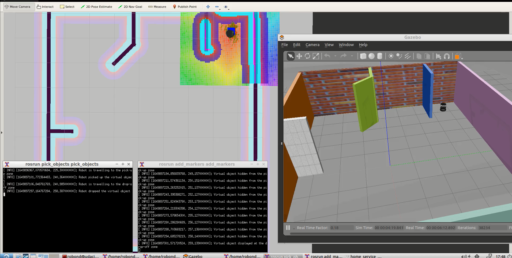

# Project #5 - Home Service Robot
<p align="center">
  
  <b>Home Service Robot Demo</b>
</p>

<p align="center">
  
  <b>Robot at Pick-Up Zone</b>
</p>

<p align="center">
  
  <b>Robot at Drop-off Zone</b>
</p>

### Overview
In this project you will simulate a full home service robot capable of navigating to pick up and deliver virtual objects. Your home service robot shall do the following:
- Initially show the marker at the pickup zone
- Robot then travels to the pickup zone
- Hide the marker once your robot reaches the pickup zone
- Wait 5 seconds to simulate a pickup
- Robot then travels to the dropoff zone
- Show the marker at the drop off zone once your robot reaches it

### Project Instructions
To program your home service robot, you will need to interface it with different ROS packages. Some of these packages are official ROS packages which offer great tools and others are packages that you’ll create. The goal of this section is to prepare and build your `catkin workspace`.

Here’s the list of the official ROS packages that you will need to grab, and other packages and directories that you’ll need to create at a later stage as you go through the project. Your `catkin_ws/src` directory should look as follows:

<b>Official ROS packages</b>
Import these packages now and install them in the `src` directory of your `catkin workspace`. Be sure to clone the full GitHub directory and not just the package itself.

1. [gmapping](https://wiki.ros.org/gmapping): With the <b>gmapping_demo.launch</b> file, you can easily perform SLAM and build a map of the environment with a robot equipped with laser range finder sensors or RGB-D cameras.
2. [turtlebot_teleop](https://wiki.ros.org/turtlebot_teleop): With the <b>keyboard_teleop.launch</b> file, you can manually control a robot using keyboard commands.
3. [turtlebot_rviz_launchers](https://wiki.ros.org/turtlebot_rviz_launchers): With the <b>view_navigation.launch</b> file, you can load a preconfigured rviz workspace. You’ll save a lot of time by launching this file, because it will automatically load the robot model, trajectories, and map for you.
4. [turtlebot_gazebo](https://wiki.ros.org/turtlebot_gazebo): With the <b>turtlebot_world.launch</b> you can deploy a turtlebot in a gazebo environment by linking the world file to it.

<b>Your Packages and Directories</b>

1. <b>map:</b> Inside this directory, you will store your gazebo world file and the map generated from SLAM.
2. <b>scripts:</b> Inside this directory, you’ll store your shell scripts.
3. <b>rvizConfig:</b> Inside this directory, you’ll store your customized rviz configuration files.
4. <b>pick_objects:</b> You will write a node that commands your robot to drive to the pickup and drop off zones.
5. <b>add_markers:</b> You will write a node that model the object with a marker in rviz.

### Directory Structure
```bash
.Project5
├── add_markers
│   ├── CMakeLists.txt
│   ├── launch
│   │   └── view_navigation.launch
│   ├── package.xml
│   └── src
│       ├── add_markers.cpp
│       └── add_markers_only.cpp
├── images
│   ├── demo.gif
│   ├── Robot_DropOff.png
│   └── Robot_PickUp.png
├── map
│   ├── map.pgm
│   ├── map.yaml
│   └── minimap.world
├── pick_objects
│   ├── CMakeLists.txt
│   ├── package.xml
│   └── src
│       └── pick_objects.cpp
├── README.md
├── rvizConfig
│   └── home_service_config.rviz
├── scripts
│   ├── add_markers.sh
│   ├── home_service.sh
│   ├── launch.sh
│   ├── pick_objects.sh
│   ├── test_navigation.sh
│   └── test_slam.sh
├── slam_gmapping
│   ├── gmapping
│   └── slam_gmapping
├── turtlebot
├── turtlebot_interactions
└── turtlebot_simulator
```

### Build Instructions
1. Open Terminal/CLI by using `Ctrl + Alt + T` shortcut.
2. Create and initialize a `catkin_ws`
```bash
mkdir -p /<your_dir>/catkin_ws/src
cd /<your_dir>/catkin_ws/src
catkin_init_workspace
```
3. Clone this repo inside `/<your_dir>/catkin_ws/src`. Pull all submodules by running
```bash
git submodule update --init --recursive
```
4. Build the code and ensure there are no build errors reported
```bash
catkin_make
```
5. Switch to `catkin_ws`
```bash
cd /<your_dir>/catkin_ws
```
6. Ensure `gmapping`, `turtlebot_teleop`, `turtlebot_rviz_launchers`, `turtlebot_gazebo` packages are installed. If not, install by running the following:
```bash
source devel/setup.bash
rosdep -i install gmapping
rosdep -i install turtlebot_teleop
rosdep -i install turtlebot_rviz_launchers
rosdep -i install turtlebot_gazebo
```
7. Build the code and ensure there are no build errors reported
```bash
catkin_make
```
8. Launch the `home_service.sh` script. Note in case the script is unable to launch due to permission error, change its permissions to make sure the scripts are executables by running chmod +x <script-name>
```bash
source devel/setup.bash
cd src/scripts/
./home_service.sh
```

### SLAM Testing
```bash
./test_slam.sh
```
By running the above script, you can manually perform SLAM by teleoperating the robot on the environment that was designed in Gazebo. The goal of this is to manually test SLAM. The script will deploy a turtlebot inside the Gazebo environment, allows for user control with keyboard commands, interfaces it with a SLAM package, and visualizes the map in rviz. The following files/packages are used to accomplish this task:
- turtlebot_world.launch deploys the turtlebot in Gazebo environment
- gmapping_demo.launch performs SLAM
- view_navigation.launch observes the map in rviz
- keyboard_teleop.launch enables manual control of the robot with keyboard commands

### Localization and Navigation Testing
```bash
./test_navigation.sh
```
By running the above script, you can pick two different goals and test the robot's ability to reach them and orient itself with respect to them. The ROS Navigation stack is utilized, which is based on the Dijkstra's algorithm, a variant of the Uniform Cost Search algorithm, to plan the robot trajectory from start to goal position. The following files/packages are used to accomplish this task:
- turtlebot_world.launch deploys the turtlebot in Gazebo environment
- amcl_demo.launch performs localization
- view_navigation.launch observes the map in rviz

### Navigation Goal Testing
```bash
./pick_objects.sh
```
By running the above script, you can autonomously command the robot to travel to both desired pickup and drop off zones. The pick_objects node communicates with the ROS navigation stack and autonomously sends successive goals for the robot to reach. The following files/packages are used to accomplish this task:
- turtlebot_world.launch deploys the turtlebot in Gazebo environment
- amcl_demo.launch performs localization
- view_navigation.launch observes the map in rviz
- pick_objects node to command the robot to travel to pick-up and drop-off zone

### Virtual Objects Testing
```bash
./add_makers.sh
```
By running the above script, you can model a virtual object in rviz. The virtual object is the one being picked and delivered by the robot, thus it should first appear in its pickup zone, and then in its drop off zone once the robot reaches it. The marker behaves as follows:
- Marker displayed at the pickup zone
- Pause 5 seconds
- Marker hidden
- Pause 5 seconds
- Marker displayed at the drop off zone

The following files/packages are used to accomplish this task:
- turtlebot_world.launch deploys the turtlebot in Gazebo environment
- amcl_demo.launch performs localization
- view_navigation.launch observes the map in rviz
- add_markers node to command the robot to travel to pick-up and drop-off zone